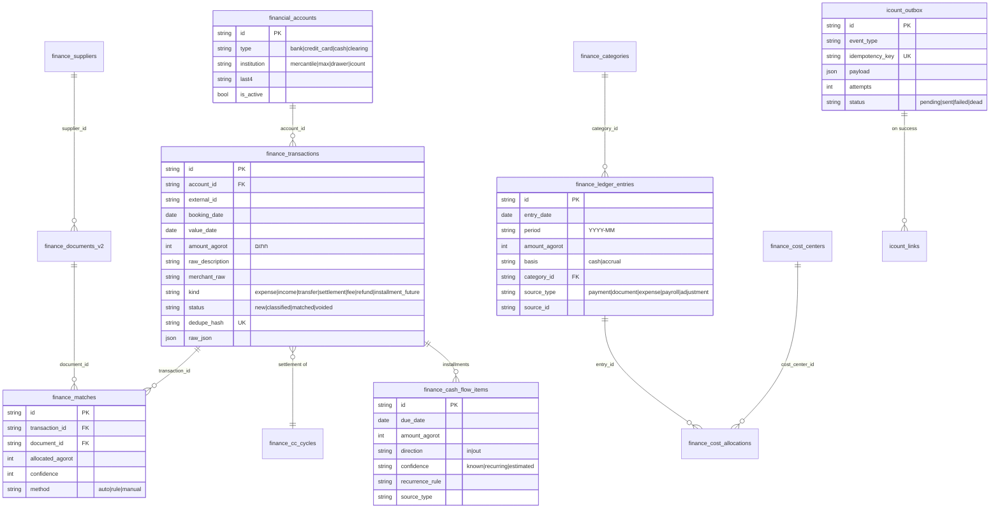

# מפת המצב הקיים — לפני בניית המרכז הפיננסי (2026-08-15)

דוח שלב R של FINANCE_SPEC.md. נאסף משבעה סוכני סריקה מקבילים + קריאה ישירה של קובצי הליבה.

## 1. איפה חי כסף היום

### הכנסות (תפעולי)
- **`payments`** (117 שורות) — שורה לכל ניסיון גבייה, מכל הזרמים: קופה, חנות ציבורית, פעילויות/טיולים, ימי הולדת (host_pays), שיעורי היכרות, ציוד, חשבונית יזומה. שדות מפתח: `amount` (ברוטו ש״ח), `status` (pending/paid/refunded/cancelled/failed), `icount_doc_number/id/url`, `cc_bill_log_id` (מ-8.8.26), שדות שיוך (`pos_sale_id`, `activity_registration_order_id`, `equipment_*`, `intro_booking_id`).
- **`pos_sales`** (45) — מכירות קופה; מכירה במזומן יוצרת invrec ב-iCount **לפני** שורת המכירה, ואז שורת payments מראה. ⚠️ כל מכירת קופה = שתי שורות כסף; אסור לסכום את שתי הטבלאות יחד.
- **`cash_ledger` / `cash_register_sessions`** — מגירת מזומן עם reconciliation אמיתי (expected מול counted, discrepancy).
- אמצעי תשלום בפועל: מזומן בדלפק, או קישור לעמוד תשלום iCount (webhook IPN חתום מסמן paid). אין מסוף פיזי. אין ביט. אין הוראות קבע ואין חיוב חודשי אוטומטי לחוגים.

### הנהלת חשבונות (מסונכרן)
- **`finance_documents`** (1,220) + **`finance_document_lines`** (401) + **`finance_payment_events`** (246) — משיכה מלאה מ-iCount (doc/search + doc/info), כולל backfill היסטורי; cron של Render כל 15 דקות עם חלון 45 יום.
- **`finance_expenses`** (2,269) — מיזוג iCount (expense/search) + ארכיון Notion, עם fingerprint dedupe.
- **`finance_suppliers`** (199) — מ-Notion.
- **`finance_bank_transactions` / `finance_expense_matches`** — ייבוא CSV בנק/אשראי + מנוע התאמה 1:1 (ניקוד 60/85) בטאב "קליטה והתאמה".

### שכר
- `wage_agreements` (8) תעריפים פר תפקיד; `work_assignments` (33) שורות עבודה עם שכר **קפוא** (`pay_amount`, `pay_frozen_at`, `pay_locked_at`); `payroll_periods` (146) מעקב תשלומים חודשי (sealed); `company_payments` (41) ביטוח לאומי ברמת חברה. **ברוטו בלבד — אין עלות מעביד.** שיוך לחוג/פעילות קיים בנתונים (`group_id`/`activity_id`) אבל אף קוד לא מסכם עלות פר חוג.

## 2. iCount — מה ממומש (server/icount.js)
Push: `client/create+update` (ensureClient עם custom_client_id), `doc/create` (invrec/offer/refund), `doc/cancel` (+refund_cc), `cc/refund` (זיכוי חלקי; לא יוצר מסמך לבד!), עמודי תשלום + IPN חתום HMAC.
Pull: `doc/search`, `doc/info`, `expense/search`, `cc/transactions` (מקור ה-cc_bill_log_id).
אין: מודול מלאי (לא זמין בחשבון), webhooks יזומים של iCount, משיכת PDF, קטגוריות הנהח״ש.

## 3. שכבת הנתונים
- `db.get/set/insert/update` = זיכרון + db.json (fire-and-forget ל-Supabase). **כתיבות כסף חייבות** `persistCore` / `db.appendOnly` (awaited).
- טבלה חדשה = שם ב-`OPERATIONAL_TABLES` (supa.js) → נשמרת כ-JSON ב-`kv_collections`, בלי מיגרציה. מיגרציות SQL אמיתיות = קובץ מתוארך ב-`database/` שמורץ ידנית ב-Supabase editor.
- `finance_audit_log` — append-only דרך `db.appendOnly`.
- אסור `supa.getAll` בראוט GET (read-through cache: `tableCache.readTable`).

## 4. הרשאות
- ראוטר הפיננסים כולו מאחורי `hasSensitiveAccess(user,'finance')`; שכר מאחורי `'hr'` נפרד.
- לצוות (staff) חייבת להיות שורת `TEAM_RULES` ב-auth.js — `/finance/*` כבר מכוסה (`cash_management` + sensitive finance). endpoint חדש מחוץ ל-`/api/finance` = 403 עד שמוסיפים שורה.
- הקליינט מציג את `/reports` רק כש-`sensitive.finance === true` (App.jsx).

## 5. קליינט
- מסך `client/src/components/FinancialReports.jsx` (729 שורות), 7 טאבים, טוען את כל 7 ה-endpoints ב-Promise.all על כל שינוי טווח. אין ספריית גרפים. עיצוב: `.finance-metric` (KPI עם accent), `.tab-bar`/`.tab-pill` (צבע לפי מיקום — לקבע עם `--tab-accent`), טוקנים ב-index.css.
- `window.fetch` עטוף גלובלית ומוסיף Bearer רק ל-URL יחסי שמתחיל `/api` — קוד חדש חייב URL יחסי.
- בדיקת מסך בלי לוגין: vite dev עם `VITE_CRM_AUTH_DISABLED=true`, או ה-harness `scripts/runLocalTestEnvironment.cjs` (client בנוי, פורט 3002→5011).

## 6. טסטים
- `node --test`; רשימת קבצים **מפורשת** ב-server/package.json — קובץ טסט חדש חייב להתווסף לרשימה או שלא ירוץ. `npm run test:finance` לתת-סט.
- דפוס בידוד: פונקציות טהורות + fake store מוזרק; `LOCAL_DURABLE_STORAGE=1` לפני import של מודולים שנוגעים ב-Supabase.

## 7. ERD — הסכמה החדשה (שלב 0) והחיבור לקיים

הקיים (payments, pos_sales, finance_documents, finance_expenses, work_assignments…) לא משתנה; ה-ledger נגזר ממנו בג'וב, וכל שורת ledger מצביעה חזרה על המקור (`source_type`+`source_id`) — זה ה-drill-down.

## 8. מלכודות שנרשמו מהסריקה (חובה לזכור בבנייה)
1. מכירת קופה = payments + pos_sales — לא לסכום פעמיים; ציוד = payments בלבד; שדרוג נעליים לא מסומן equipment_payment.
2. refund_amount מלא רק בזיכוי חלקי/ידני; זיכוי מלא מזוהה מ-status בלבד.
3. ההכנסה בדשבורד מגיעה ממסמכי iCount; תשלום בלי מסמך נראה רק בדוח התפעולי.
4. קובץ טסט חדש שלא נוסף לרשימת ה-test script — לא רץ בכלל.
5. שדה חדש בטבלת DIRECT לא נשמר בלי mapper; בטבלת kv נשמר אוטומטית.
6. עלות שכר — לקרוא רק סכומים קפואים (pay_amount), לעולם לא לחשב מחדש מתעריף נוכחי.
7. מחזור צבעי הטאבים תלוי-מיקום — טאב חדש בלי `--tab-accent` מזיז צבעים לכל הבאים אחריו.
